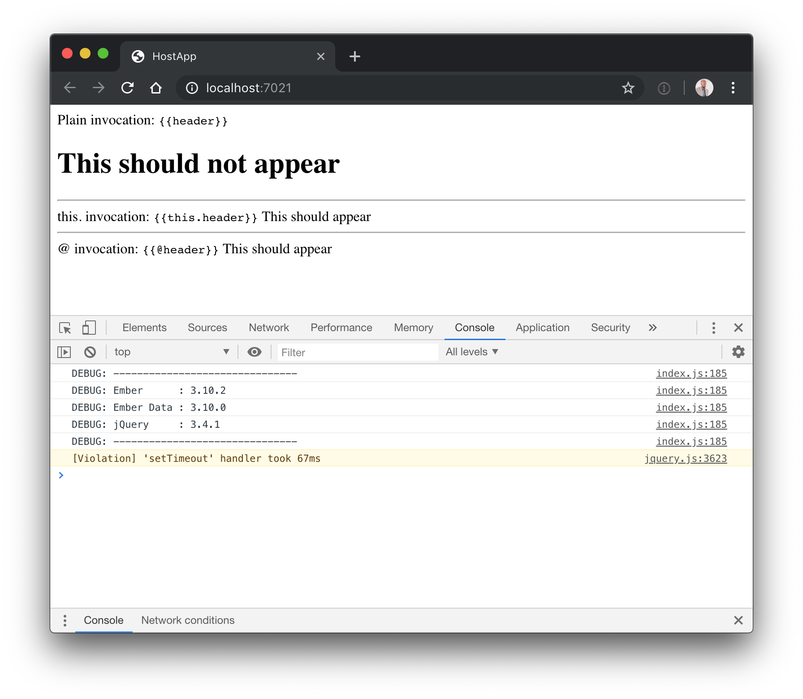
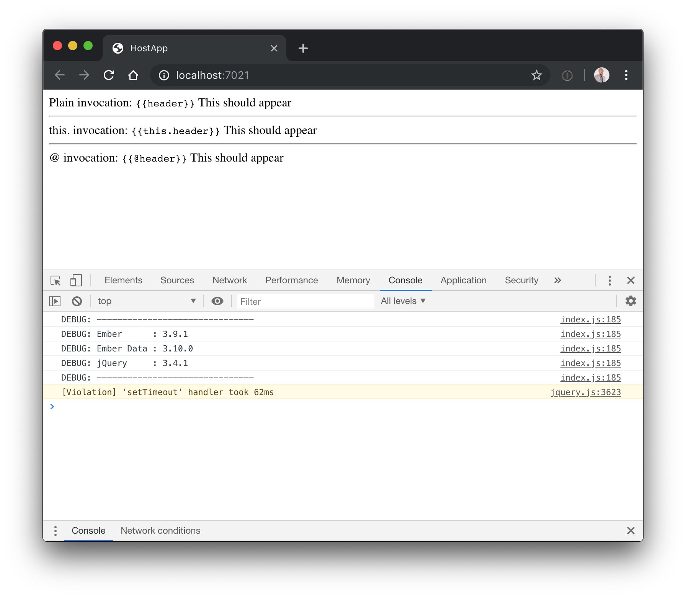

## Ember 3.10 Property Fallback/Component Invocation Reproduction

Steps:

* `ember new host-app`
* `ember g component header`
* add content to header.hbs
* `ember g component my-banner`
* add `{{header}}` to my-banner.hbs
* add `<MyBanner @header="This should appear">` to application.hbs
* See header component content instead of "This should appear"

### Ember 3.10

### Ember 3.9

